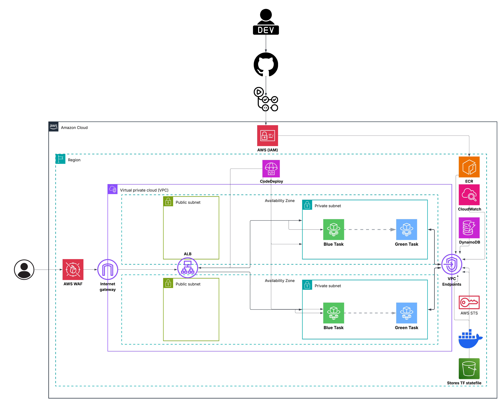

# Production-Grade URL Shortener on AWS ECS

Production-ready URL shortener infrastructure built on AWS ECS Fargate with blue/green deployments, VPC endpoint architecture, and WAF protection. Demonstrates cost-optimized cloud deployment patterns without compromising security or reliability.

## Overview

This project implements a scalable URL shortening service using AWS ECS with zero-downtime blue/green deployment capabilities. The infrastructure eliminates common cost drains like NAT Gateways by leveraging VPC endpoints for AWS service connectivity, resulting in production-grade architecture that runs under $100/month.

The system handles all core requirements: automated deployments, security hardening, observability, and cost optimization while maintaining operational simplicity.

## Key Features

**Blue/Green Deployments** - Zero-downtime releases with automatic rollback on health check failures
**VPC Endpoint Architecture** - Private AWS service connectivity without NAT Gateway overhead
**WAF Protection** - Rate limiting, SQL injection, and XSS protection at the edge
**Cost Optimized** - Right-sized resources, lifecycle policies, pay-per-request billing
**Security Hardened** - Distroless containers, OIDC authentication, least privilege IAM
**Automated CI/CD** - GitHub Actions pipeline with vulnerability scanning and deployment automation

## Architecture



**Request Flow:**
```
User → WAF → ALB → Blue/Green Target Groups → ECS Tasks (private subnets) → DynamoDB
```

**Stack Components:**
- **Compute:** ECS Fargate (0.25 vCPU, 512 MB) in private subnets
- **Networking:** VPC with endpoints (replaces NAT Gateway)
- **Load Balancing:** ALB with blue/green target groups across 2 AZs
- **Security:** WAF with rate limiting and AWS managed rule sets
- **Database:** DynamoDB (pay-per-request, point-in-time recovery)
- **CI/CD:** GitHub Actions with OIDC, CodeDeploy orchestration
- **Infrastructure:** Terraform (10 modules, S3 remote state)

## Technical Highlights

### VPC Endpoints Over NAT Gateway

Traditional AWS setups route private subnet traffic through NAT Gateways ($32/month + data charges). This architecture uses VPC endpoints for all AWS service communication, providing private connectivity through AWS's internal network.

**VPC Endpoints Configured:**
- `ecr.api` - Docker authentication
- `ecr.dkr` - Image manifests and metadata
- `logs` - CloudWatch logging
- `sts` - IAM role assumption
- `s3` (gateway) - ECR image layers
- `dynamodb` (gateway) - Application data

**Result:** Zero internet access, reduced attack surface, no single point of failure, $29/month vs $32/month NAT Gateway.

### Blue/Green Deployment Pipeline

```
Code Push → Tests → Build → Security Scan → ECR Push → Task Definition → CodeDeploy
  → Green Tasks Created → Health Checks → 10% Traffic (5 min) → 100% Traffic → Blue Termination
```

**Deployment characteristics:**
- Total time: ~15 minutes from push to production
- Canary shift: 10% traffic for 5 minutes before full cutover
- Automatic rollback: <1 minute on health check failure
- Zero user impact during deployments

### Security Implementation

**Network Isolation:**
- ECS tasks in private subnets with no public IPs
- No NAT Gateway or internet gateway routes
- VPC endpoints provide AWS service access only
- Security groups restrict ALB-to-task communication (port 8080)

**IAM Least Privilege:**
- Task role: `dynamodb:GetItem/PutItem` on specific table only
- Execution role: ECR pull and CloudWatch write permissions scoped to resources
- OIDC roles for CI/CD: separate permissions for app deployments vs infrastructure changes

**Container Security:**
- Distroless Python base image (no shell, no package manager)
- Non-root user (UID 65532)
- Multi-stage build excludes build dependencies from runtime
- Trivy vulnerability scanning in CI/CD pipeline

**WAF Rules:**
- Rate limiting: 2000 requests per 5 minutes per IP
- SQL injection protection (AWS managed rule set)
- XSS protection (AWS managed rule set)
- Known bad inputs blocking (AWS managed rule set)

## Directory Structure

```
.
├── .github/workflows/
│   └── deploy.yml               # CI/CD pipeline
├── app/
│   ├── src/
│   │   ├── main.py             # FastAPI application
│   │   └── ddb.py              # DynamoDB operations
│   ├── tests/                  # Unit tests
│   └── Dockerfile              # Multi-stage distroless build
├── infra/
│   ├── global/backend/         # Terraform state backend
│   ├── envs/dev/               # Environment configuration
│   └── modules/                # Infrastructure modules
│       ├── vpc/
│       ├── vpc-endpoints/
│       ├── alb/
│       ├── ecs/
│       ├── codedeploy/
│       ├── waf/
│       ├── iam/
│       ├── dynamodb/
│       ├── ecr/
│       └── cloudwatch-logs/
└── docs/evidence/              # Deployment documentation
```

## Deployment

### Prerequisites

```bash
terraform >= 1.5
aws-cli >= 2.0
docker >= 20.0
AWS account with appropriate permissions
```

### Setup Instructions

**1. Deploy Terraform Backend**
```bash
cd infra/global/backend
terraform init && terraform apply
```

**2. Deploy Infrastructure**
```bash
cd ../../envs/dev
terraform init && terraform apply
# Creates 48 resources in approximately 8 minutes
```

**3. Push Initial Image**
```bash
cd ../../../
./push-image.sh latest
```

**4. Verify Deployment**
```bash
ALB_DNS=$(terraform -chdir=infra/envs/dev output -raw alb_dns_name)

# Health check
curl http://$ALB_DNS/health

# Shorten URL
curl -X POST http://$ALB_DNS/shorten \
  -H "Content-Type: application/json" \
  -d '{"url":"https://github.com"}'

# Access shortened URL
curl -L http://$ALB_DNS/{short_code}
```

**5. Trigger Blue/Green Deployment**
```bash
# Make code change
echo "# Update" >> app/src/main.py

# Push to trigger pipeline
git add . && git commit -m "Deploy update" && git push

# Monitor in GitHub Actions and CodeDeploy console
```

**6. Teardown**
```bash
cd infra/envs/dev
terraform destroy -auto-approve

cd ../../global/backend
terraform destroy -auto-approve
```

## Cost Breakdown

**Monthly Operating Cost: $65-89**

| Component | Cost | Notes |
|-----------|------|-------|
| ALB | $16 | Fixed cost, 2 availability zones |
| ECS Fargate | $10 | 0.25 vCPU, 512 MB memory |
| VPC Endpoints | $29 | 4 interface endpoints at $7.20 each |
| WAF | $5+ | Base charge plus request volume |
| DynamoDB | Variable | Pay-per-request pricing |
| Logs/Storage | $3-10 | 7-day retention, 10 images |

**Comparison to traditional setup:** Saves approximately $32/month by eliminating NAT Gateway, plus operational overhead reduction from serverless compute.

## Design Decisions

**VPC Endpoints vs NAT Gateway**
Private AWS service connectivity eliminates internet gateway dependency, reduces attack surface, removes single point of failure. Higher upfront configuration complexity, lower operational risk.

**Blue/Green vs Rolling Deployments**
Zero-downtime guarantee with instant rollback capability. Temporary 2x resource usage during deployment window (~10 minutes) acceptable for reliability benefit.

**Fargate vs EC2**
Serverless container orchestration removes operational overhead of server management. Per-task pricing model aligns with actual usage, eliminates idle capacity costs.

**Distroless Container Images**
60% size reduction improves deployment speed, attack surface minimization from removal of shell and package managers. Debugging requires CloudWatch Logs instead of exec access.

**OIDC vs Static Credentials**
Temporary credentials eliminate rotation requirements and reduce breach risk. GitHub-specific implementation acceptable for security benefit.

## Monitoring and Observability

**CloudWatch Metrics:**
- ECS Container Insights: CPU, memory, network per task
- ALB: Request count, status codes, response time, healthy host count
- WAF: Blocked requests, allowed requests, rule matches
- DynamoDB: Read/write capacity consumed, throttled requests

**Logging:**
- ECS task logs: `/ecs/ecs-v2-url-shortener` (7-day retention)
- WAF logs: `/aws/wafv2/ecs-v2-url-shortener`
- All logs routed through VPC endpoints (no internet connectivity required)

## Challenges Solved

**ECS Tasks Couldn't Pull Images**
Root cause: Missing `ecr.dkr` VPC endpoint
Solution: Added 3 ECR endpoints (api, dkr) + S3 gateway for image layers
Learning: ECR stores layers in S3. Both endpoint types required.

**CodeDeploy Target Group Mismatch**
Root cause: ECS service created with Blue TG, CodeDeploy expected control
Solution: ECS service must use `CODE_DEPLOY` controller, Terraform uses `lifecycle.ignore_changes`
Learning: CodeDeploy manages target group swapping, not Terraform.

**WAF Rate Limit Not Triggering**
Root cause: 2000 limit is per 5-minute window, not burst
Solution: Sustained traffic testing with Apache Bench
Learning: WAF needs sustained load, not single bursts.

**Health Check Path Mismatch**
Root cause: ALB checking `/healthz`, app responds on `/health`
Solution: Changed ALB target group health check path to `/health`
Learning: Verify health check paths before deployment, not during.

## Production Considerations

**Current implementation suitable for:**
- Development and staging environments
- Low to moderate traffic applications
- Cost-sensitive deployments
- Demonstration and proof-of-concept work

**Production enhancements to consider:**
- HTTPS with ACM certificate and Route53 domain
- Multi-AZ task deployment (desired_count >= 2)
- CloudWatch alarms with SNS notifications
- Auto-scaling policies based on CPU/memory metrics
- DynamoDB TTL for automatic URL expiration
- Multi-region deployment for disaster recovery
- X-Ray distributed tracing integration

## License

MIT

---

**Questions or issues?** Open a GitHub issue.
